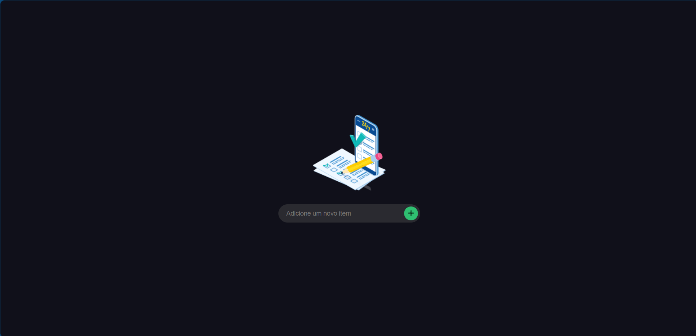
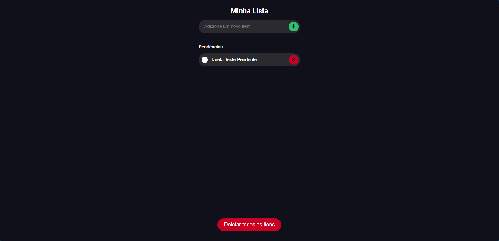
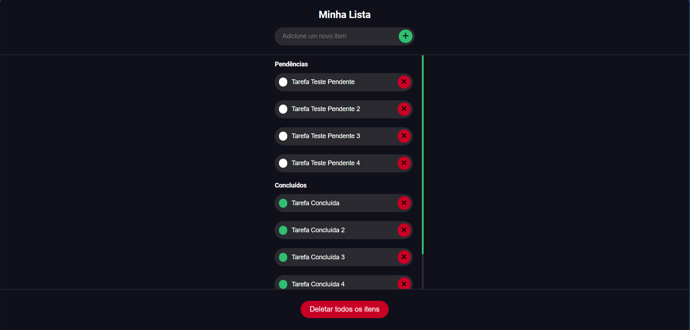

# ToDoList

Projeto de estudo em desenvolvimento Angular, usando a versão 17.1.1.

## Objetivo

Promover uma lista de tarefas, pendente e completadas de forma simples e funcional.

## Telas

*Tela do app caso não tenha nenhuma tarefa adicionada.*

*Tela com um item na lista de pendentes.*

*Tela com um item na lista de pendentes.*
